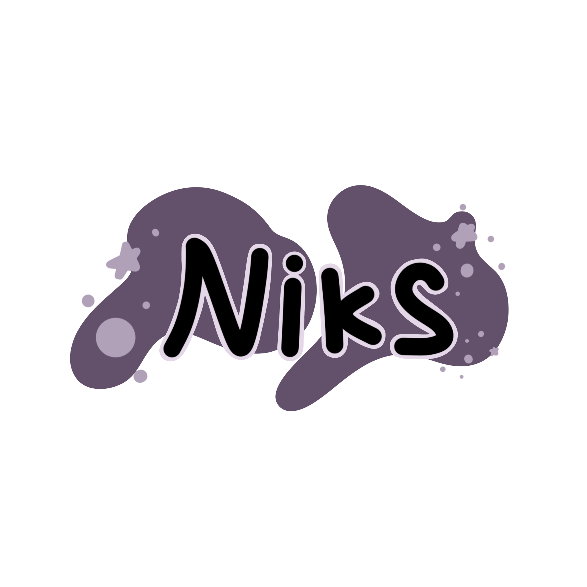

<!-- ABOUT THE PROJECT -->
<h1 align="center">
  <br>
    <a href="#" target="_blank"></a>
  <br>
  <p>Niks</p>
</h1>

<h4 align="center">Niks are made with <a href="https://developer.apple.com/swift/" target="_blank">Swift 5</a> & <a href="https://figma.com" target="_blank">Figma</a>.</h4>

<p align="center">
  <a href="#about">About</a> •
  <a href="#preview">Preview</a> •
  <a href="#installation">Installation</a> •
  <a href="#features">Installation</a> •
  <a href="#contributors">Contributors</a> •
  <a href="#license">License</a>
</p>

# About
Niks  is an app that we crafted to empower academy fellow learners to build a habit that will relax their minds and body to help them fall asleep faster. Many of them, just like Bobby, are overwhelmed by their daily activities, thus making them unable to easily fall asleep. Our app will show you a variety of animation and pleasing visuals, with seamless flow and easy control for the user to use.

### Preview
<p align="center">
  <a href="#" target="_blank"></a>
  <a href="#" target="_blank"></a>
  <a href="#" target="_blank"></a>
  <a href="#" target="_blank"></a>
</p>

<!-- ABOUT THE FILE & FOLDER STRUCTURE -->
## Folder & File Structure
Beriut struktur file dan folder pada Niks:

    .
    ├── Assets                              # Aset Warna, Logo & Gambar
    ├── Data                    
    │   └── FruitData.swift                 # Berisikan Static Local Data Variable
    │
    ├── Model                   
    │   └── FruitModel.swift                # Berisikan Fruit Local Data Type Declaration
    │
    ├── Component                   
    │   ├── FruitCardComponent.swift        # Berisikan Komponen Fruit Onboarding Card (OnBoardingView)
    │   ├── StartButtonComponent.swift      # Berisikan Komponen Start Button (OnBoardingView)
    │   ├── FruitRowComponent.swift         # Berisikan Komponen Fruit Row (ContentView)
    │   ├── FruitHeaderComponent.swift      # Berisikan Komponen Fruit Header (FruitDetailView)
    │   ├── SourceLinkComponent.swift       # Berisikan Komponen Source Link (FruitDetailView)
    │   ├── FruitNutrientsComponent.swift   # Berisikan Komponen Fruit Nutrient Value (FruitDetailView)
    │   ├── SettingLabelComponent.swift     # Berisikan Komponen Settings Label (SettingsView)
    │   └── SettingRowComponent.swift       # Berisikan Komponen Settings Row (SettingsView)
    │
    └── View                     
        ├── OnBoardingView.swift            # Tampilan OnBoarding Page
        ├── Tutti_Fruity.swift              # Root Project: Konfigurasi ContentView
        ├── ContentView.swift               # Tampilan Home Page
        ├── FruitDetailView.swift           # Tampilan Detail Page for Each Fruit
        └── SettingsView.swift              # Tampilan Halaman Setting

<!-- List of Features -->
# Features:

* Reusable Components
* All Stacks (HStack, VStack, ZStack)
* Custom Modifier
* User Notifications (Daily Notification every 10.00 pm)
* Watch Connectivity
* AVKit for Music
* Animation Sequence

<!-- Used Tools -->
## Build With

* [Swift](https://www.swift.org/documentation/)
* [SwiftUI](https://developer.apple.com/documentation/swiftui/)
* [Xcode](https://developer.apple.com/xcode/)
* [Figma](https://developer.apple.com/xcode/)

<!-- Contributors -->
## Contributors

* [Adriel Bernard Rusli](https://github.com/Adrielrusli)
* [Abner Edgar](https://github.com/AbnerEdgar)
* [Bobby Sugiharto](https://github.com/bobbysaa)
* [Deka Primatio Deandra](https://www.github.com/dekapd99)
* [Millennian Ibnu Adriansyah Karinda](https://github.com/Adriankrnd)
* [Rachmaniar Larasati](https://github.com/niarlaras10)

<!-- How to Install -->
# Installation
Untuk menggunakan repositori ini, ikutilah petunjuk penggunaan berikut dan pastikan git sudah terinstall pada komputer (semua perintah dilaksanakan pada `cmd.exe` atau `terminal`):

1. Lakukan download .zip atau `clone` repositori dengan cara:
```bash
git clone https://github.com/dekapd99/Niks.git
```

2. Jika sudah Download / Clone Project, silahkan buka Project di Xcode dengan Klik Open a Project or File.
3. Pastikan untuk memilih iPhone 14 pada Target Simulator (Kolom Device dibagian atas XCode). 
4. Build & Run

<!-- What Kind of License? -->
# License
MIT License: Copyright (c) 2022

DISCLAIMER: ASSETS ARE USED FOR EDUCATION PURPOSE ONLY, NOT FOR COMMERCIAL PURPOSES

Assets Source: [SF Symbols 4 Icon](https://developer.apple.com/sf-symbols/)

<p align="right">(<a href="#top">back to top</a>)</p>
